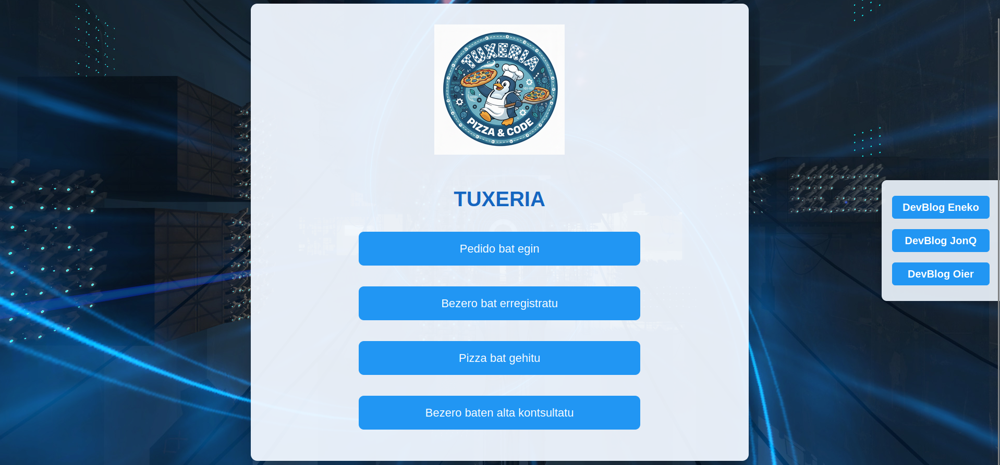

# Tuxeria

**Tuxeria** es una aplicación web para la gestión básica de una pizzería ficticia,
desarrollada como proyecto educativo en el centro de Formación Profesional CIFP Elorrieta Erreka Mari LHII.

Permite administrar clientes, pizzas y pedidos mediante una interfaz sencilla
conectada a una base de datos MySQL.

---

## ⚙️ Tecnologías

- HTML5  
- CSS3  
- PHP 8.2  
- MySQL 8  

---

